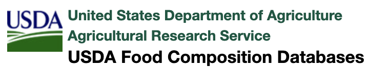

## Executive Summary:

### Objective:

Mapping Instacart's food items with USDA food and nutrients data, analyze and get insights on user's previous Instacart's food orders and predict whether or not the user reorders the product. The prediction also provides additional nutrient information on each of the food products.

## Approach:

This repository contains my work performed on [Instacart Market Analysis](https://www.instacart.com/datasets/grocery-shopping-2017) dataset hosted on kaggle, along with the [USDA published USDA National Nutrient Database for Standard Reference](https://www.ars.usda.gov/ARSUserFiles/80400525/Data/SR-Legacy/SR-Leg_ASC.zip).

## Data Description

Instacart is an on-demand grocery delivery platform facilitating doorstep deliveries of groceries and other home essentials in major cities of USA.

Instacart data - 

    orders (3,421,083 rows, users ):
    * order_id: order identifier
    * user_id: customer identifier
    * eval_set: which evaluation set this order belongs in (see SET described below)
    * order_number: the order sequence number for this user (1 = first, n = nth)
    * order_dow: the day of the week the order was placed on
    * order_hour_of_day: the hour of the day the order was placed on
    * days_since_prior: days since the last order, capped at 30 (with NAs for order_number = 1)

    products (49,688 rows):
    * product_id: product identifier
    * product_name: name of the product
    * aisle_id: foreign key
    * department_id: foreign key

    aisles (134 rows):
    * aisle_id: aisle identifier
    * aisle: the name of the aisle

    deptartments (21 rows):
    * department_id: department identifier
    * department: the name of the department

    ord_prod_prior_df (32,434,489 rows):
    * order_id: foreign key
    * product_id: foreign key
    * add_to_cart_order: order in which each product was added to cart
    * reordered: 1 if this product has been ordered by this user in the past, 0 otherwise

The US Department of Agriculture (USDA) National Nutrient Database for Standard Reference 
(SR; http://www.ars.usda.gov/Services/docs.htm?docid=8964) is the major source of food composition data in the United States and provides the foundation for most food composition databases in the public and private sectors.
  

    DATA_SRC.txt - us-ascii - Sources of Data (DATA_SRC) File - shape (606, 9)
    DATSRCLN.txt - us-ascii - Sources of Data Link (DATSRCLN) File - shape (228457, 3)
    DERIV_CD.txt - us-ascii - Data Derivation Code Description (DERIV_CD) File - shape (57, 2)
    FD_GROUP.txt - us-ascii - Food Group Description - shape (25, 2)
    FOOD_DES.txt - iso-8859-1 - Food Description (FOOD_DES) File - shape (7793, 14)
    FOOTNOTE.txt - iso-8859-1 - Footnote (FOOTNOTE) File - shape (537, 5)
    FOOTNOTE_out.txt - us-ascii - Footnote (FOOTNOTE) File - shape (312, 5)
    LANGDESC.txt - us-ascii - LanguaL Factor Description (LANGDESC) File - shape (773, 2)
    LANGUAL.txt - us-ascii - LanguaL Factor (LANGUAL) File - shape (37910, 2)
    NUTR_DEF.txt - iso-8859-1 - Nutrient Definition (NUTR_DEF) File - shape (149, 6)
    NUT_DATA.txt - us-ascii - Nutrient Data (NUT_DATA) File - shape (644125, 17)
    SRC_CD.txt - us-ascii - Source Code (SRC_CD) File - shape (10, 2)
    WEIGHT.txt - us-ascii - Weight (WEIGHT) File - shape (14449, 7)

* Note: **Information provided by food manufacturers is label data. Manufacturers are responsible for descriptions, nutrient data and ingredient information. USDA calculated values per 100 g from values per serving.** 

## Methodology

### EDA & Pre-Processing

#### Instacart Data
- Load all the Instacart Data into respective data frames.
- Analyze the data, review the data types, and check for Nulls 
- Merge Prior Orders with Products, Orders, Departments and Aisles data. After merging these data frames into one single data frame, the size of the resultant data frame has 32,434,489 rows and 15 columns.
- As my interest falls in analyzing the Orders related to food products (particulary Veg. food), identification was done in a two step process.

        First is to identify the food related products. I have chosen to eliminate all the products that are not related to food.
        Size of the resultant data frame has 27,150,466 rows and 15 columns.
        
        Second is to separate out the orders related to Veg. food and the ones related to Meat. 
        Size of the data frame with Orders related to Veg. food has 26,297,625 rows and 15 columns. 
        Size of the data frame with Orders related to Meat has 852,841 rows and 15 columns.
        
- Found the list of users who ordered only Veg. food and no Meat, users who are not overlapping with any other Meat orders - 79352
- Review and analyze the data, visualize data with various graphs

#### USDA Food and Nutrient Data
- Load all the USDA Food and Nutrient Data into respective data frames.
- Analyze the data, review the data types, and check for Nulls
- Merge Food Groups, Food Description using Food Group ID; Merge Nutrient Definition and Nutrient Description data, and merge other relevant data frames. After merging these data frames Food and Food description data frame has 7793 rows and 15 columns. Nutrient data frame has 644125 rows and 22 columns.
- My interest falls in analyzing the Orders related to food products (particulary Veg. food).
- Created a new data frame excluding specific food groups and foods.
- In the Nutrient data, I have included only specific nutrients and eliminated others.
- Include Veg. food and eliminate Meat, also exclude some prepared, packaged food items.

Food and Nutrients can be searched using the USDA's site:
[USDA Food and Nutrients Search](https://ndb.nal.usda.gov/ndb/search/list)

* ** Interesting Facts from the InstaCart Data **
    - "Banana" is the top choice in over 3 Million Instacart Orders.
    - Most of the top 10 food products ordered are Fruits and Vegetables. 
    - Most of the Instacart Orders were made during the weekends (Saturday and Sunday).

### Feature Engineering

* My idea is to merge Instacart Food Products with that of USDA Food and Nutrition data, to analyze the nutrients for Instacart's food orders.
* To achieve this, I have included specific food types, departments and aisles from Instacart data, included specific food groups and food items from the USDA Food data, and included specific Nutrients from the USDA Nutrients data, combining all of them into a single usable data frame for analysis.
* Instacart's food products and USDA Food are matched using the [fuzzywuzzy](https://github.com/seatgeek/fuzzywuzzy) string match, getting the closest match.
* Identified and included Nutrients were flipped and pivoted to show the nutrients as columns, listing the nutrients for each of the NDB Number.
* Defined X and y( column 'reordered') variables for modeling.

### Modeling

* Since this is a classification problem,Classification Machine Learning Algorithms as logistic regression, bagging classifier, decision trees, random forests, adaboost classifier and XG boost were used in  modeling. XG boost performed better than other models.
* Evaluated metrics such as accuracy, f1 score.

### Takeaways

* Focus on clustering analysis and recommender systems.

* Focus on feature engineering.

* Correlated features for feature selection.

## Citations
https://www.instacart.com/datasets/grocery-shopping-2017
https://www.ars.usda.gov/ARSUserFiles/80400525/Data/SR-Legacy/SR-Leg_ASC.zip
https://www.ars.usda.gov/ARSUserFiles/80400525/Data/SR-Legacy/SR-Legacy_Doc.pdf
https://ndb.nal.usda.gov/ndb/search/list
https://github.com/seatgeek/fuzzywuzzy

